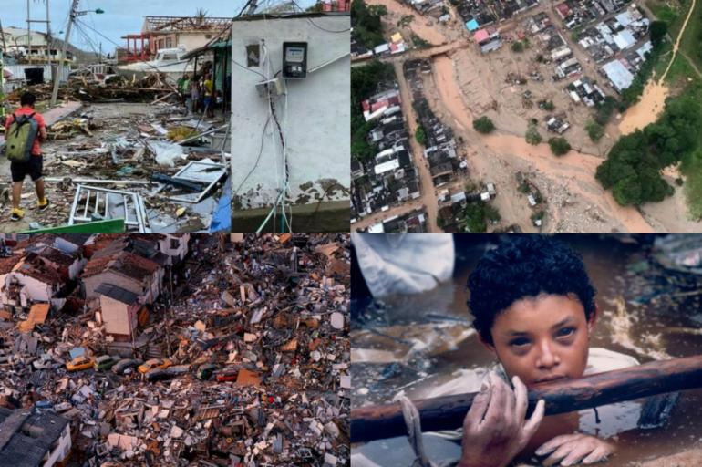

# Natural disasters in Colombia: case studies

I believe that education can save lives, so let's learn from past events in our country.

> "The key to risk reduction is understanding risk itself, education about it, and the determined and committed participation of all social, 
> private, and public actors in its resolution" (Lavell, 1999).

# Contents

## [Introduction - Importance of environmental education in Colombia](introduction.md)

### [Volcano threats](volcano.md)

### [Earthquake threats](earthquake.md)

### [Hurricane threats](hurricane.md)

### [Landslide threats](landslide.md)

## [Conclusion - Some lessons learned](conclusion.md)

---------------------------------------------------------------

> **Author:** [Alejandro Franco García](about-me.md)
> 
> **email:** alfrancog@unal.edu.co
> 
> **Undergraduate program:** Geology
> 
> **Program:** Explora UN Mundo / Intensive English Program - Group 3
> 
> **Teacher:** Andrés Felipe Micán Castiblanco
> 
> **2021-1**
